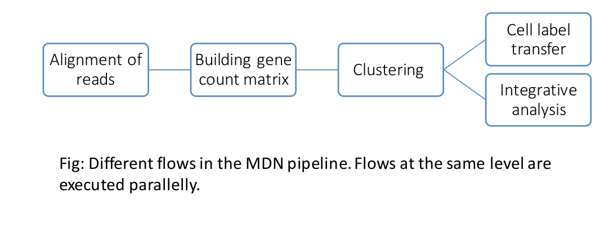

## MultiScale Digital Neuroanatomy (Computational track)

### Motivation 
With the advent of new technologies like drop-seq, obtaining genetic data nowadays is easier than ever. It's projected that genomics will require up to 110 PB of storage a day within the next decade. By contrast, Youtube requires 3-5PB/day and astronomy requires 3-4PB/day. 

In order to utilize this data to it's full potential, automation and quality analytics software is necessary. We present mdn, a pipeline for fully automated cell labelling and cross species integrative analysis. It supports analysis of 700+ species by identifying and mapping orthologous genes in the genetic data and can be used via command line or an easy to use web based interface. 

### Results 
We compared our [cell labelling results](nemo-biccn-test.md) with the manually curated ones on the BICCN portal and found the labels to be in agreement most of the time, with our pipeline providing more granular information regarding the cell types compared to the manually tagged. 

Since these results are probabilistic in nature, further fine tuning might be required in some cases in order to zero in on the exact cell type. Even in those cases, the labels obtained will serve as a good starting point to do literature survey for manual identification of cell types. 

### Design and implementation 

The pipeline makes use of snakemake to tie up different modules for computation as shown in the figure.  

The different modules share data amongst themselves by caching intermediate results as `.rds` files. This design decision enables us to resume previous job which may have failed at an intermediate step and saves overall computation time. 

The users can interact with the `snakemake` pipeline via command line or the web portal. Both of these options work by generating a `config.yaml` file which is used by the triggered snakemake job to run appropriate modules. More details on which can be found here. 

### Methods
The pipeline is broadly divided into two parts, Alignment and Analysis. They can be executed independent of each other using either the web portal or the CLI. 

The alignment pipeline takes in raw `fastq` reads from species, aligns it with the reference transcriptome of the species (or closest available one) using `cellranger` and generates a gene count matrix. We also perform various quality checks on the `fastq` files using tools such as `FastQC` and `MultiQC`. 

The analysis pipeline takes in the gene count matrix of a species as an input from the user. The gene count matrix is pruned for presense of any mitochondrial genes; variable genes are then selected from the gene count matrix which are used to cluster cells together and find markers for the respective clusters. Since, there's a lot of information available about the cell types and marker genes for humans and mice, we use orthologs from given species to these with methods like ORA or GSEA to infer the probable cell type from the gene expression of cells in a cluster. The pipeline uses a package called `clustermole` in order to perform GSEA. 

Users can also perform integrative analysis on multiple species by specifying a gene count matrix for each, on top of automated cell labelling. We make use of two approaches for the same as described by [Kebschull et. al. 2020](https://www.science.org/doi/10.1126/science.abd5059) and [Tosches et. al. 2018](https://www.science.org/doi/10.1126/science.aar4237). 

### Future work
- The code in the repository is in alpha stage, more work is needed to make it more robust to various system and user errors that might occur. 
- The pipeline outputs can be made more interactive and customizable by using dymanic plots (e.g. plotly) instead of static in the future. This will allow users to interact and get a better sense of the data on the browser itself without having to download data locally. 
- The output from the current pipeline can be used for many interesting analyses, extending the pipeline to add modules for them and providing functionality allowing users to change and replace parts of the pipeline on demand would be helpful. 

### Installation and Usage
Details on how to run the pipeline on your own system can be found [here](setting-up.md). An overview of the web based interface is present in [this page](getting-started.md). 

### Documentation 
More details regarding various parts of the pipeline are available on [this page](documentation.md). 