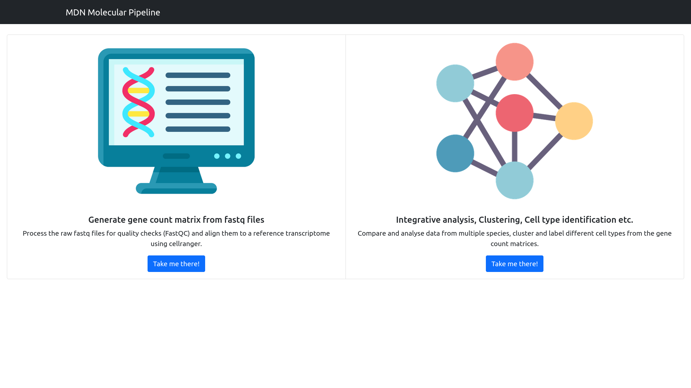
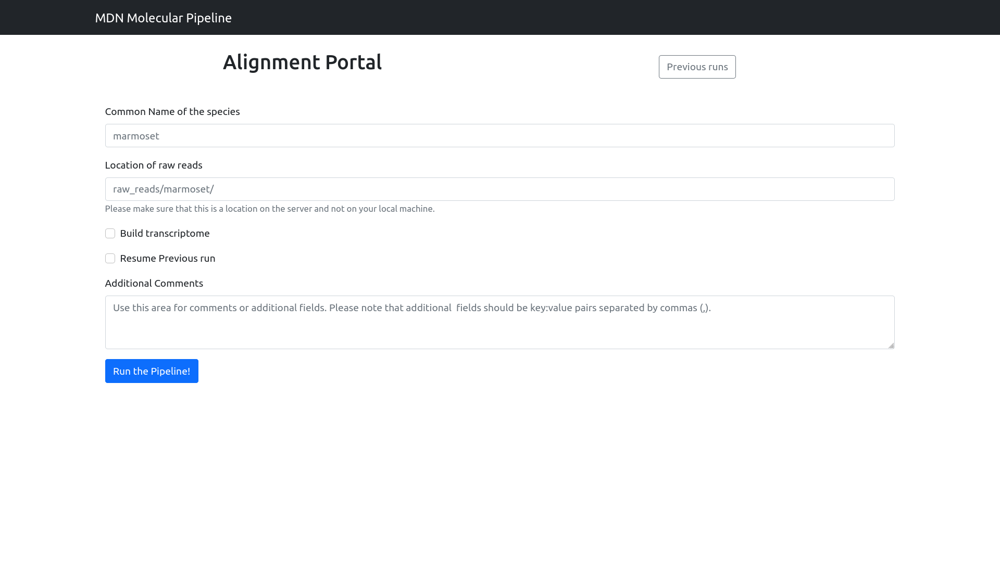

# Getting Started

## The landing page

Above picture shows the landing page of the MDN portal. There are two options for the user to choose from: 
1. Generate gene count matrix from fastq files. 
2. Analyze previously obtained gene count matrices for different species.
The user can pick a appropriate function based on their requirement using the buttons below. 

## Alignment Portal

The alignment portal allows the user to align the raw fastq reads to a reference trnascriptome and find out what genes are present in that particular raw file. There are some reference transcriptomes that are already available on the server. You’ll find those species in the dropdown menu in the first textbox (Common name of the species). For others, you’ll have to build a reference transcriptome from the .fa and .gtf files obtained either from the Ensembl or NCBI portal (Note that the data over Ensembl is relatively clean and should be preferred over data from NCBI). 

The user is also provided with an option to resume any previous runs which may have been aborted midway because of some issues as well as adding some comments or additional IDs that they may want to keep a track of. 

- **Common name of the species**: What the name says, however there might be many variations in the common name of a species, so later versions will include a dropdown for the species for which a transcriptome is available. For the ones that don’t have one, you can include them by adding a custom species and building the transcriptome. 
- **Location of raw reads**: Location of the fastq files on the server, both absolute path and paths relative to the snakemake directory will work. 
- **Build Transcriptome **: Build a transcriptome from genome reads and annotations if it’s not already present for the species that you’re interested in. In order to perform this operation, you'd need to upload the appropriate files to the BIRDS server. 
    - **Location of genome reads**: Location of the `.fa` file containing the genome reads on the server. 
    - **Location of genome annotations**: Location of the `.gtf` file containing the gene annotations for the provide `.fa` file. 
- **Resume Previous run**: Allows you to resume a pipeline run that failed because of some reason. You need to provide the run ID of the previous run that you'd like to resume. You can find that in the previous runs section. 
- **Comments**: Additional comments or fields that you'd like to store in the database about the current run. 

## Analysis Portal 

The analysis portal allows the user to cluster and label cells and perform integrative analysis on the data obtained from the alignment pipeline. e.g. the gene count matrices. By default, the pipeline runs cell clustering and labelling for a single species. You can view all the previous runs in the Previous runs page (linked on top of the webpage) and download data and plots related to them. 

A brief description of the different options present to the user are as follows: 
- **Name of the first species**: Name of the species that you're upload the gene count matrix of. 
- **File upload**: File selection menu for the gene count matrix. 
- **Integrated study of multiple species**: Checkbox, enabling which will allow you to perform integrative analysis of multiple species. 
- **Custom analysis ID**: Instead of automatically generating an analysis ID for the current run, use a custom ID. Useful in cases where you want to tie the IDs back together with some other portal. 