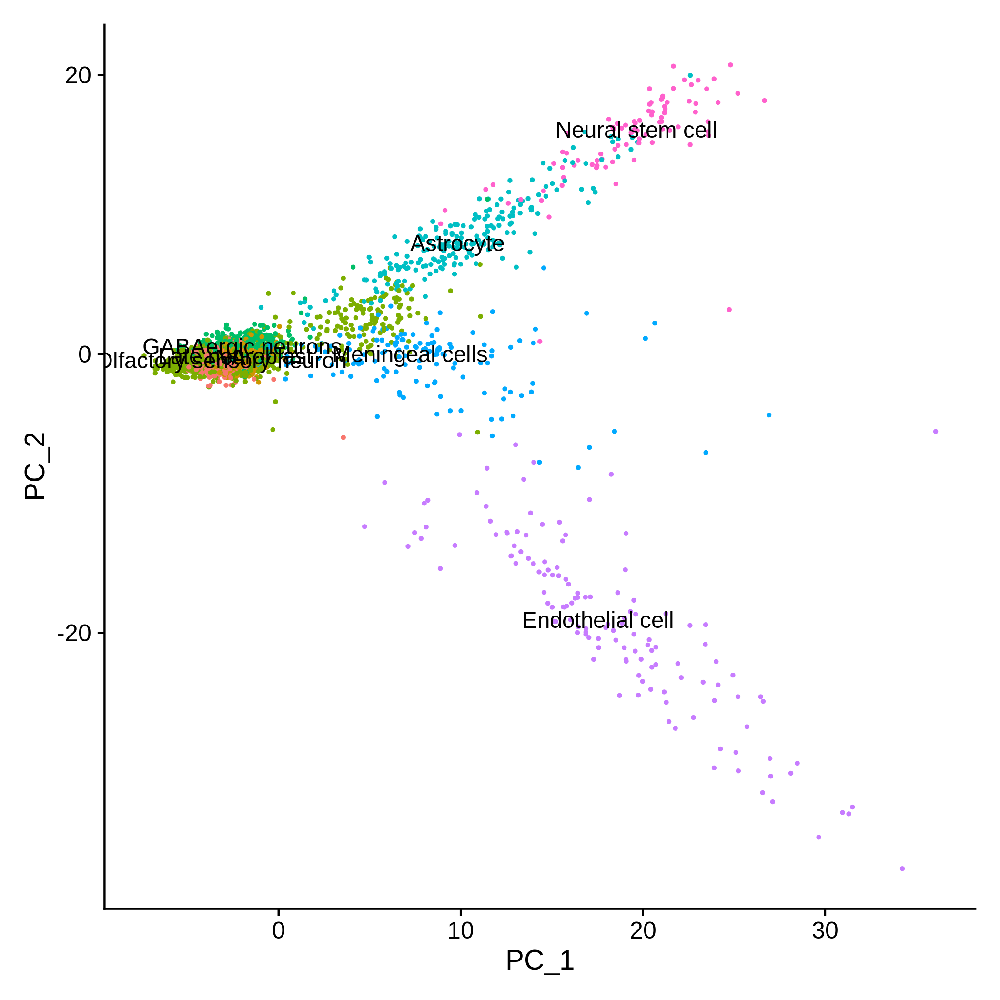
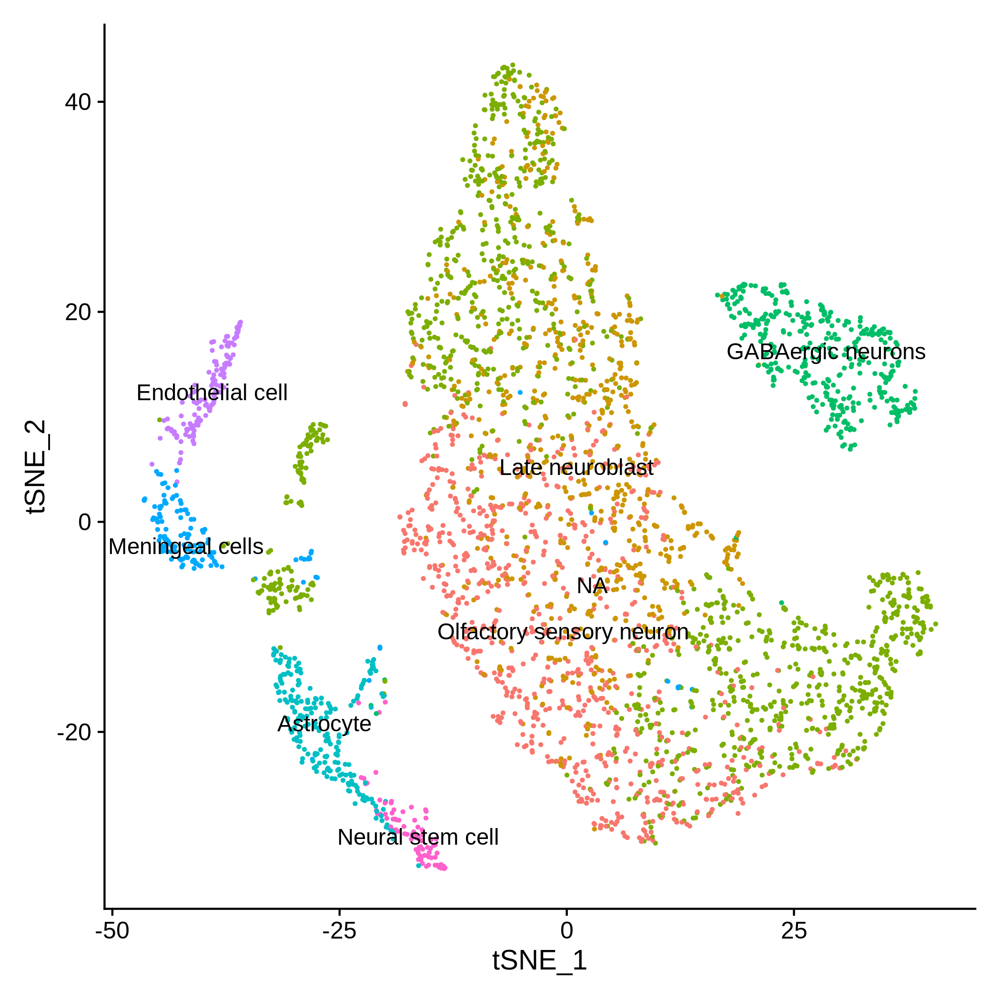
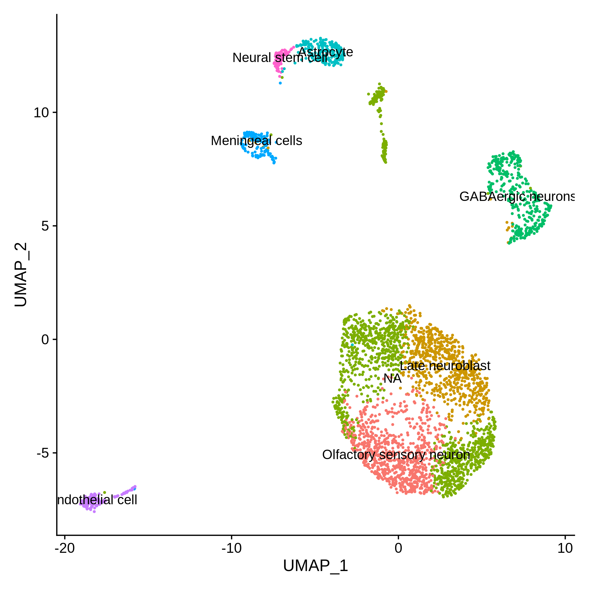
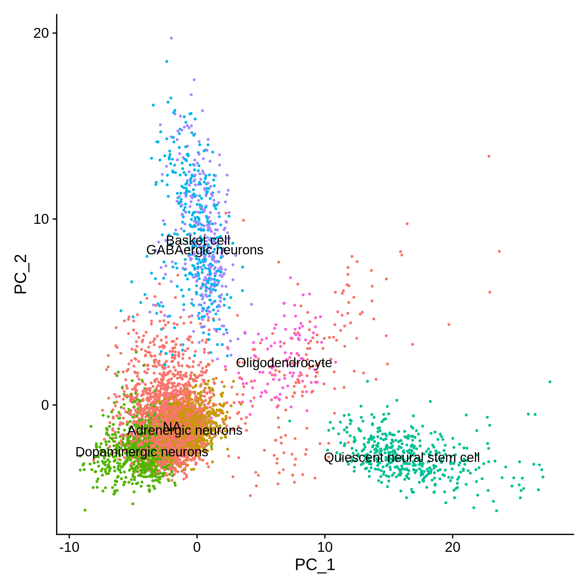
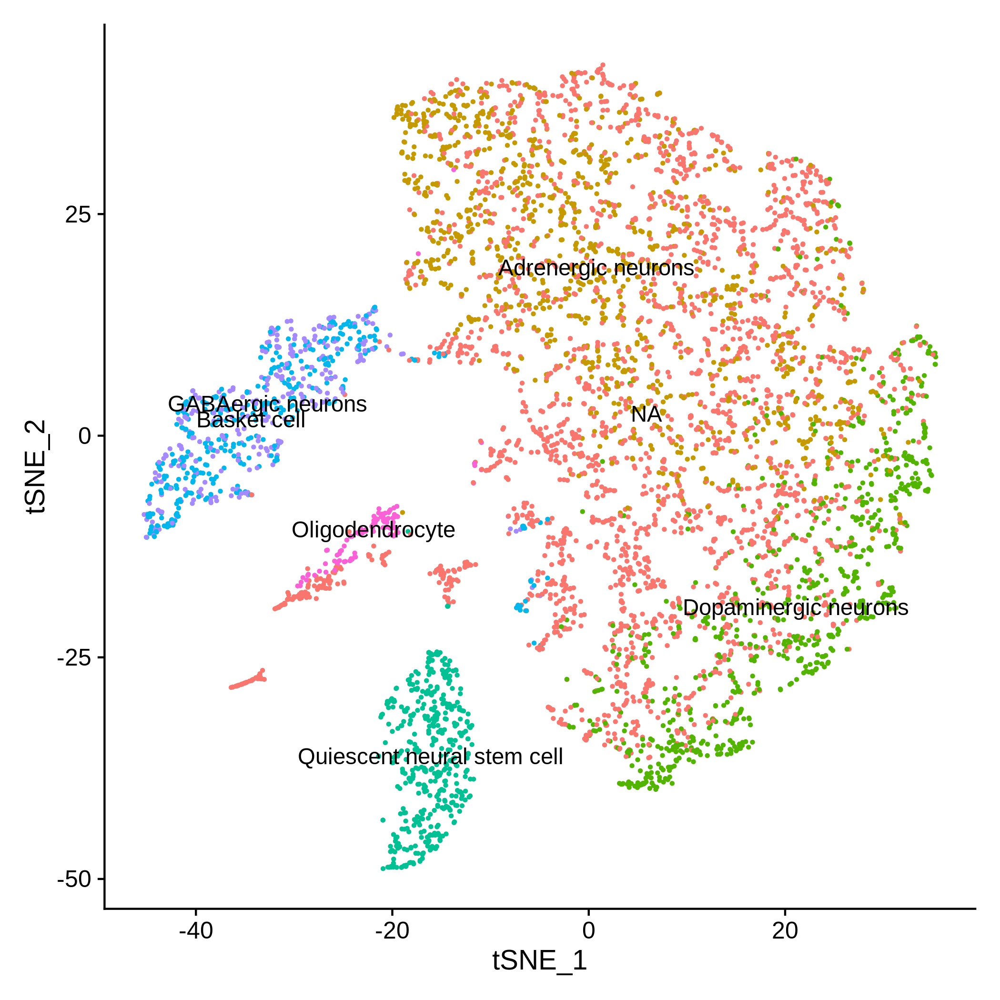
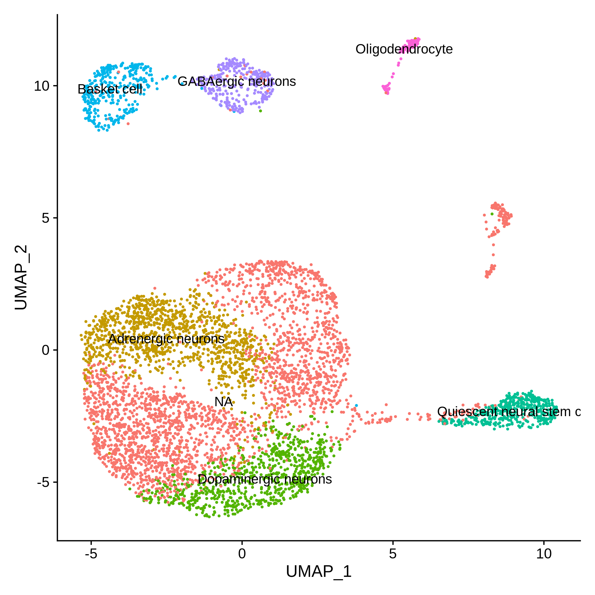

## Comparison of results from the BICCN portal with our pipeline. 

### Experiment 1: 
- [Brain Architecture Portal](http://braincircuits.org/viewer4/mouse/map/28918N/7648125), [NeMo Portal](https://portal.nemoarchive.org/files/bd318b43-6460-47f9-85f6-c74c3f67d2af), [BICCN Portal](https://singlecell.broadinstitute.org/single_cell/study/SCP477/single-nuclei-dataset-orb-pl-md720-md721?scpbr=biccn-anatomy-and-morphology-project)

### Experiment 2: 
- [Brain Architecture Portal](http://braincircuits.org/viewer4/mouse/map/28919N/7648561), [NeMo Portal](https://portal.nemoarchive.org/files/9a71cbd5-98ba-4caa-bb43-ff2ff6c6a5b5), [BICCN Portal](https://singlecell.broadinstitute.org/single_cell/study/SCP554/pbiccnsmmrvispi700701rbd180325?scpbr=biccn-anatomy-and-morphology-project#/)

