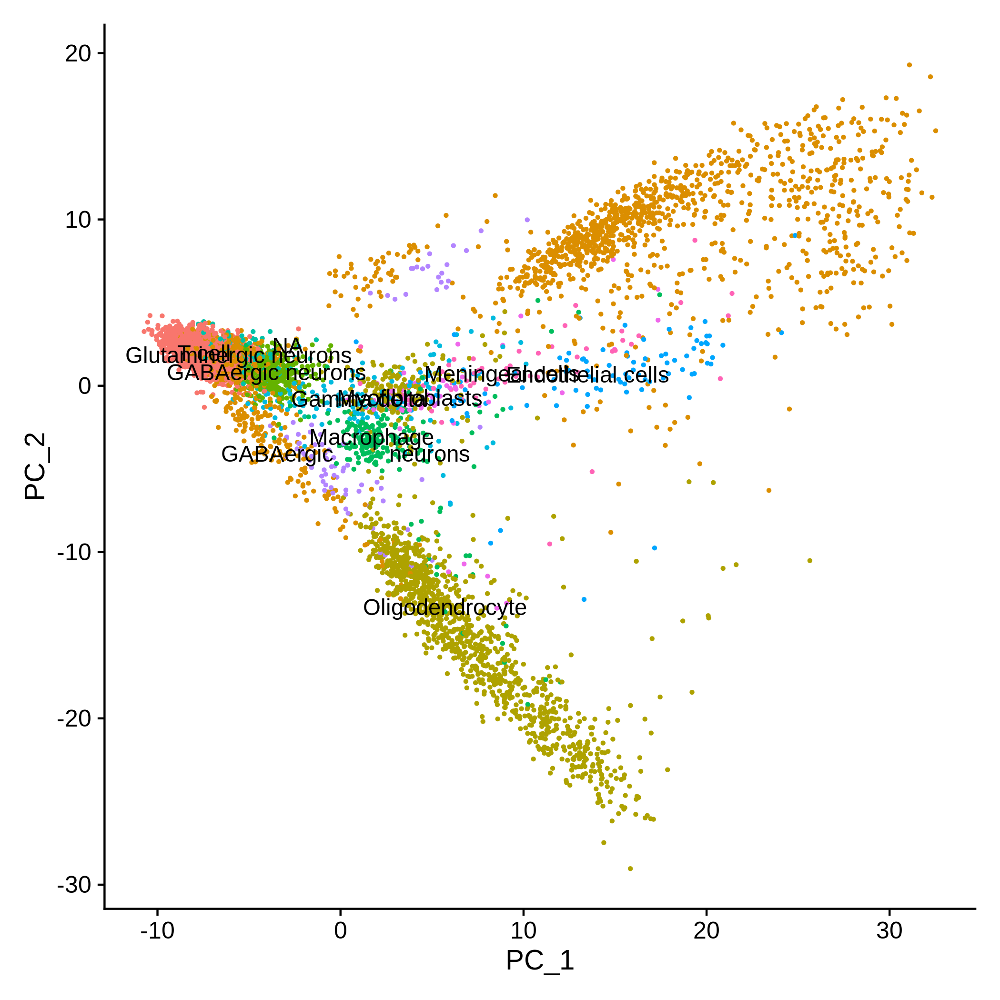
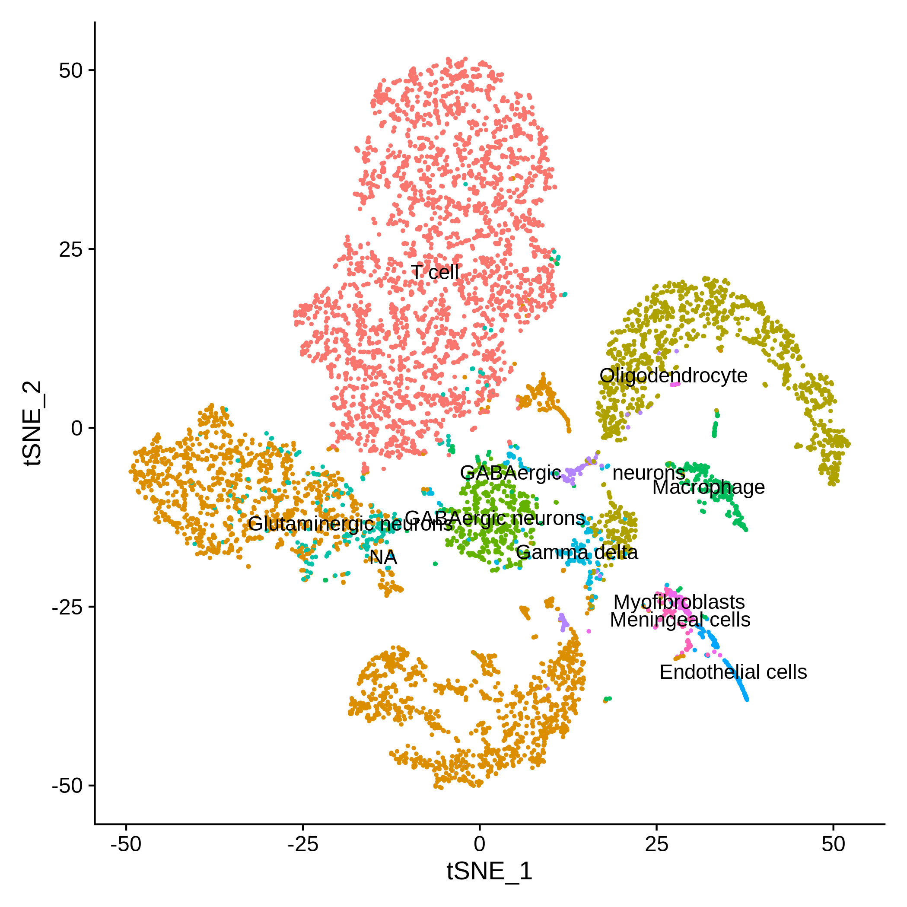
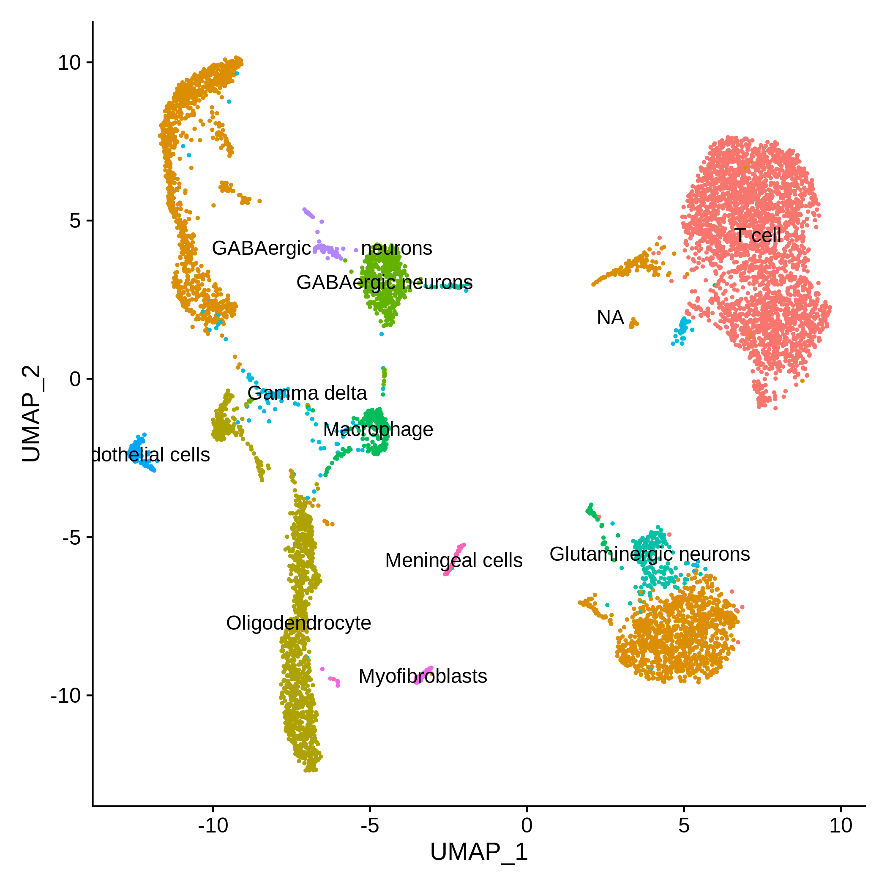

## Comparison of results from the BICCN portal with our pipeline. 

The BICCN portal contains two plots, One is PCA and another is tSNE. The PCA plots over there are in 3D, but from a certain angle they look almost the same as the ones that we have in 2D. The tSNE plots are similar but not exactly the same, which I believe is due to tSNE being a non-deterministic algorithm. 

Cell labels for almost all clusters are in agreement, with differences in granularity (with our labels being more granular). There are however some cases, where the labels are different (which could be due to the differences in how the labels are assigned i.e. GSEA vs Marker genes). 

### Experiment 1: 
- [Brain Architecture Portal](http://braincircuits.org/viewer4/mouse/map/28918N/7648125), [NeMo Portal](https://portal.nemoarchive.org/files/bd318b43-6460-47f9-85f6-c74c3f67d2af), [BICCN Portal](https://singlecell.broadinstitute.org/single_cell/study/SCP477/single-nuclei-dataset-orb-pl-md720-md721?scpbr=biccn-anatomy-and-morphology-project)

### Experiment 2: 
- [Brain Architecture Portal](http://braincircuits.org/viewer4/mouse/map/28919N/7648561), [NeMo Portal](https://portal.nemoarchive.org/files/9a71cbd5-98ba-4caa-bb43-ff2ff6c6a5b5), [BICCN Portal](https://singlecell.broadinstitute.org/single_cell/study/SCP554/pbiccnsmmrvispi700701rbd180325?scpbr=biccn-anatomy-and-morphology-project#/)

### Experiment 3: 
- [Brain Architecture Portal](), [NeMo Portal](), [BICCN Portal](https://singlecell.broadinstitute.org/single_cell/study/SCP662/single-nuclei-dataset-nucleus-accumbens-md736?cluster=PCA&spatialGroups=--&annotation=cell_type__ontology_label--group--study&subsample=all#study-visualize)

